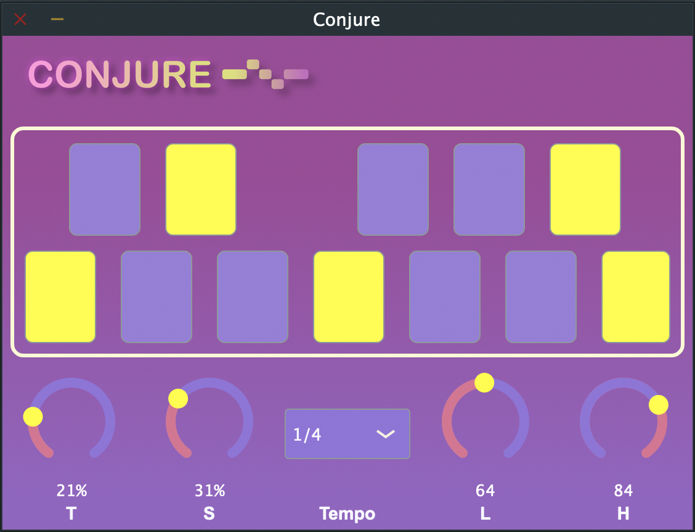

# Conjure

Conjure is a Midi generating plugin. Given user defined parameters, Conjure will randomly generate MIDI notes. 

## Parameters

`T` - Percentage chance that the timing (tempo) will change randomly. 

`S` - Percentage change that any given note may be silent. 

`Tempo` - Select at what tempo new notes should be created. 

`L` - Lower bounds for the pitch of randomly generated notes. 

`H` - Upper bounds for the pitch of randomly generated notes. 

	

